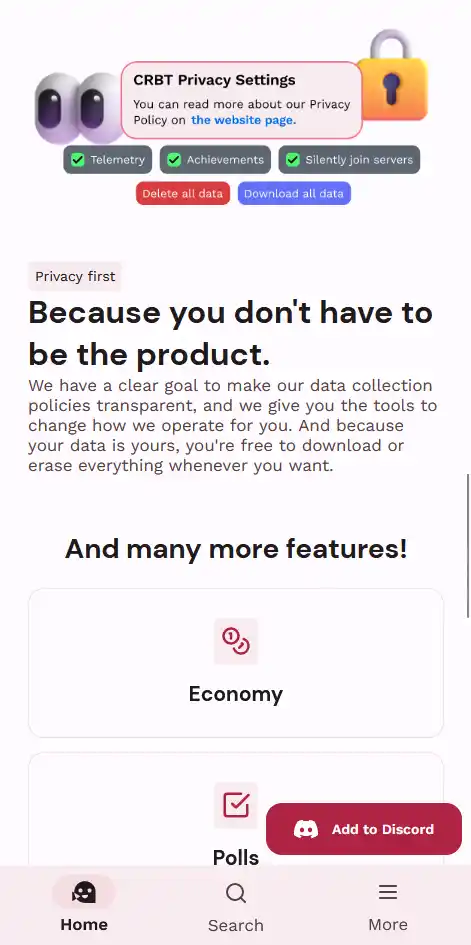
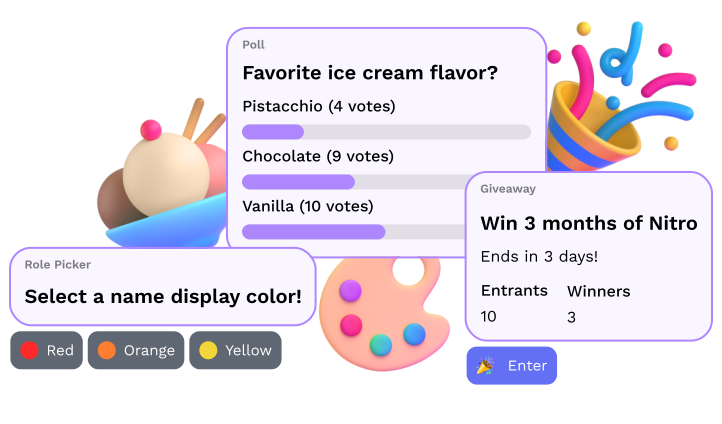
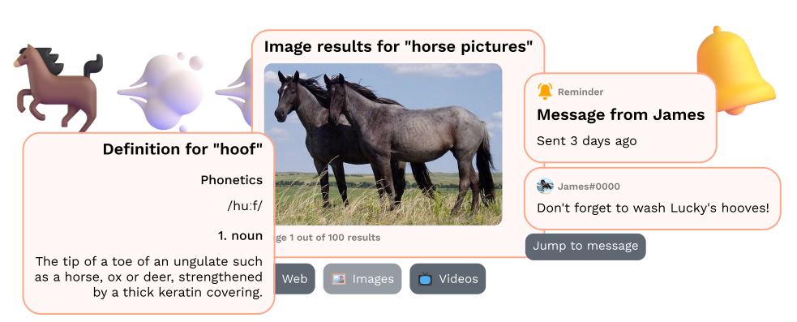

## Overview

I started CRBT in 2019 as my very first coding experiment, and over the years it's become more
complete and defined, as a true multi-purpose Discord bot.

As the project evolved a lot the past year, its website needed a serious refresh to reflect it, and
what the future holds for it. Inspired by Material You, the new website features a clean and refined
design that works on all screen sizes and themes.

## Interactive demo

The multi-purpose Discord bot market being satured, CRBT's website needed to stand out. I opted for a way to preview the bot by replicating the typical Discord experience!

<video controls>
  <source
    src="/blog-assets/crbt-2023/interactive-demo.webm"
    type="video/webm"
  />
</video>

## Illustrations

The new illustrations feature Microsoft's gorgeous Fluent Emojis and embrace the iconic Discord embeds with different hues, representing CRBT's customization capabilities!

## Special thanks

Thanks to [Chloe](https://paperclover.net) for helping with some of my CSS shenanigans.
