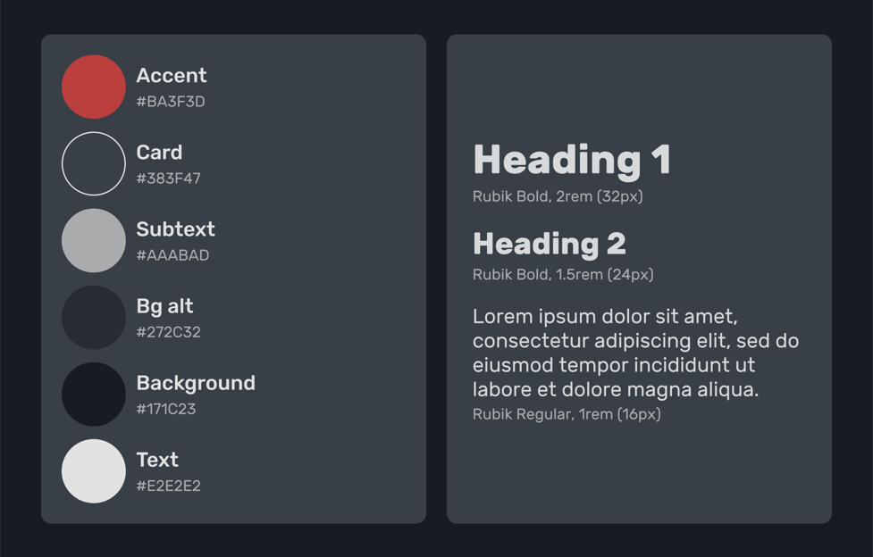
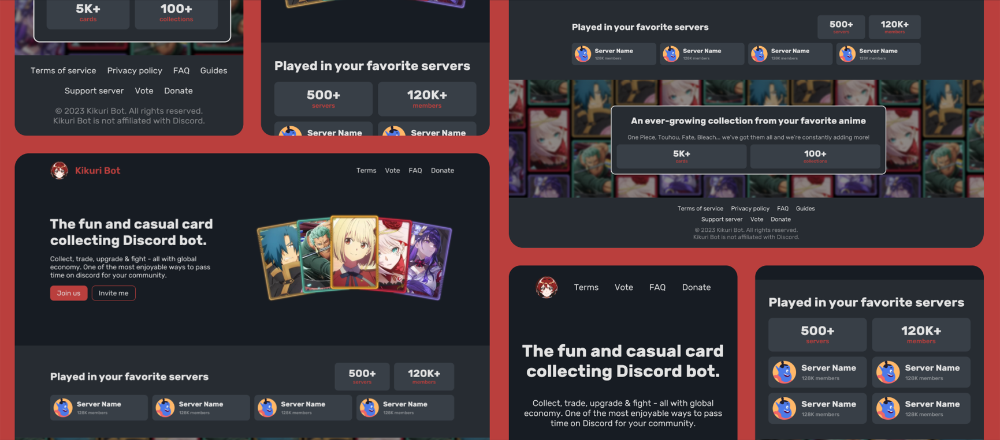
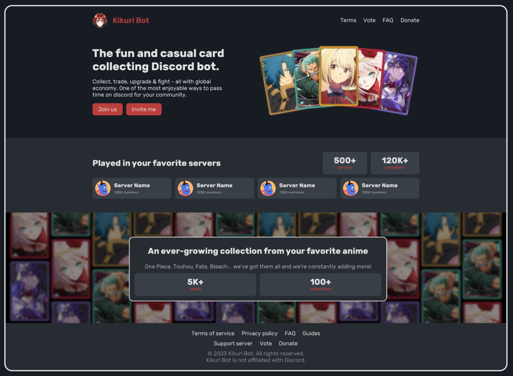

## Overview

Kikuri is a Discord bot about an anime-themed card-collecting global economy where users collect,
trade, and upgrade their cards, to fight against other users. Kikuri’s team approached me to
redesign their website for mobile and desktop, to make it more content-rich and responsive while
using the brand’s core identity.

## Branding

For the branding, I'm using the colors and fonts I was provided with: Red accents, a dark theme, and Rubik for the font.

## Responsive

Kikuri's old website was not really optimized for mobile, which was something I ought to solve by revamping their navbar for more clarity, and big making buttons bigger.

## Resourceful

I was tasked to add some sections about Kikuri, like stats about what servers it is part of, and some about its expansive collection of cards.

For the former, I chose a simple list of servers with their member counts, to highlight to bigger ones and give Kikuri more credibility.

For the cards section, I chose to make a background full of the card design I was provided, that in practice would infinitely scroll at random speeds to give the website more depth and parallax. Stats are overlaid on top of this, showing how much cards and collections there is.

