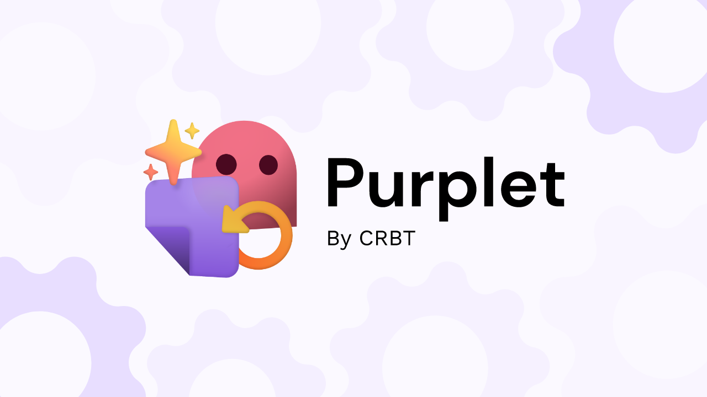
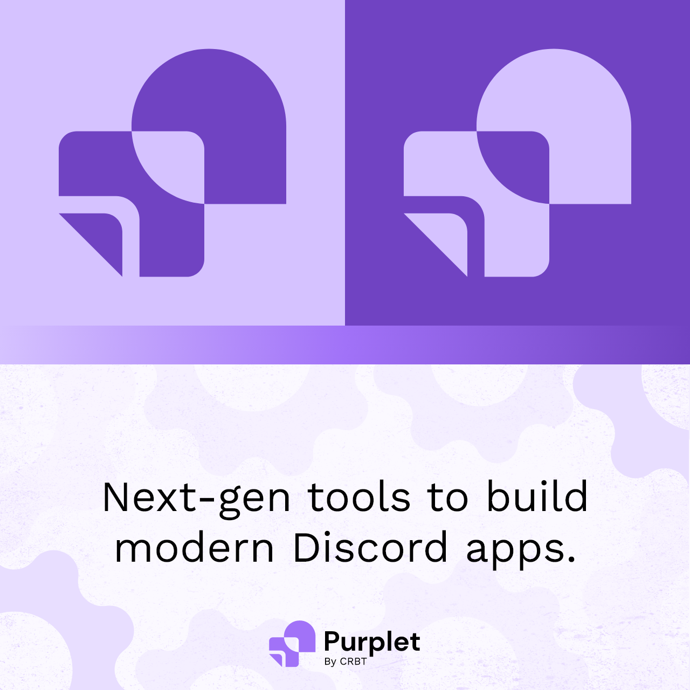
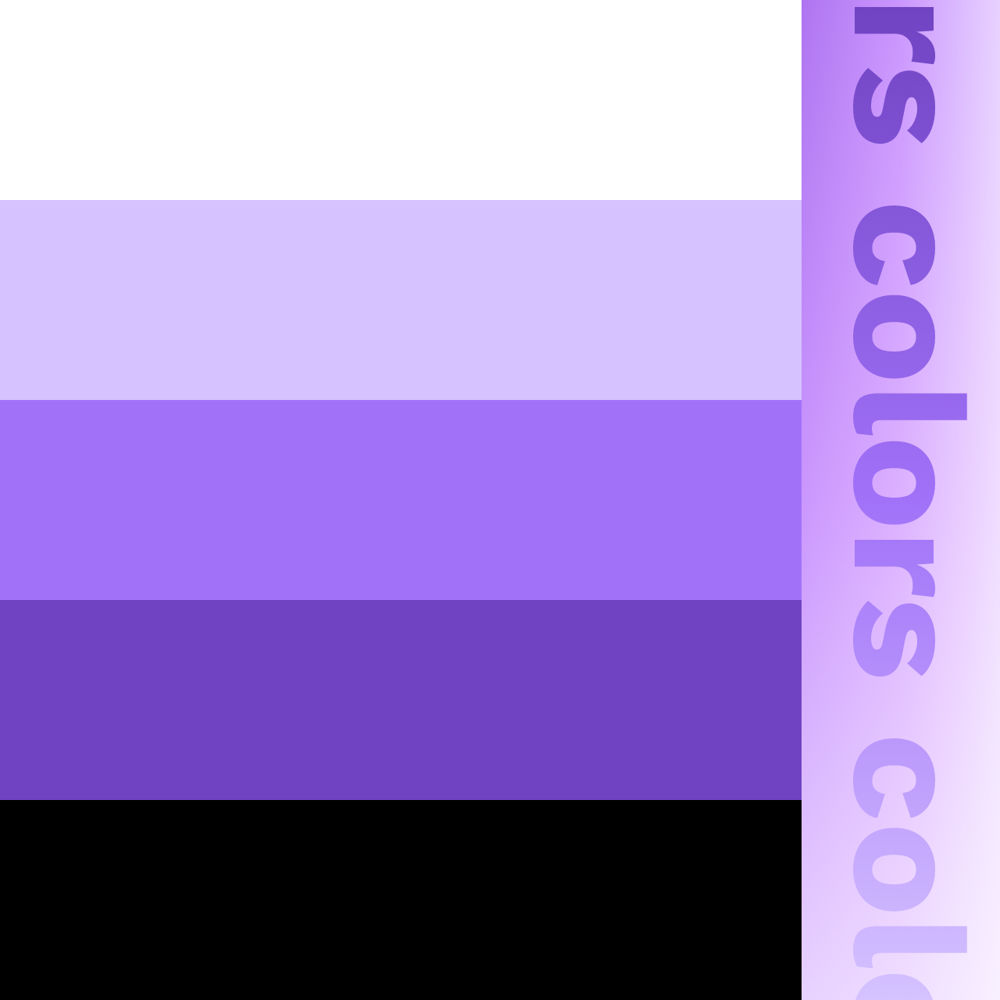
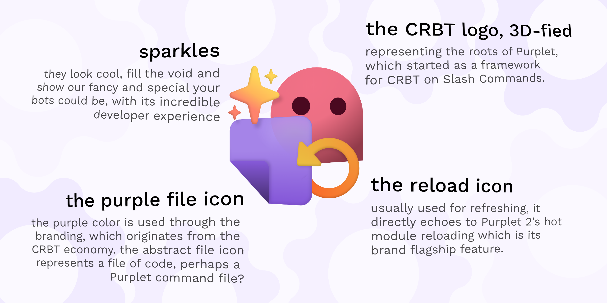
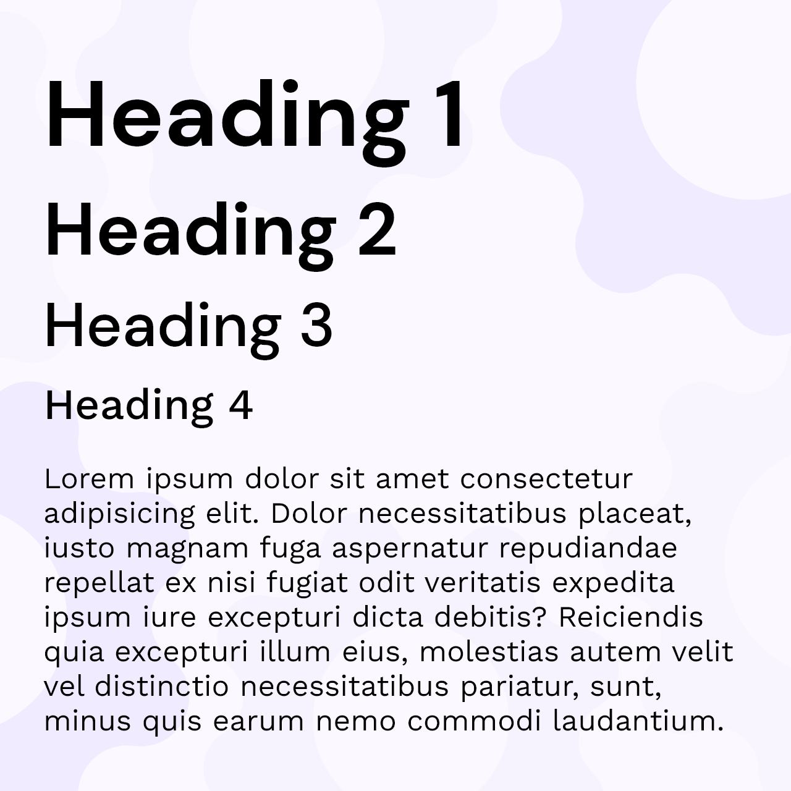

## About

Purplet began last year as a platform to create Discord bots using the JavaScript language on top of the [Discord.js](https://discord.js.org/) library, mainly developed and maintained by [paperclover](https://papercllover.net), and where I did all of the promotional stuff, and the branding.

Since June 2022, we've expanded Purplet as an ecosystem of libraries for building modern Discord apps by leveraging [Slash Commands](https://discord.com/blog/slash-commands-permissions-discord-apps-bots) and components, among other things. We've also put our efforts to work on a remake of the framework that features faster speeds and hot reloading, which allows developers to quickly shift between ideas as the bot commands reload when they make changes to them.

Ahead of Purplet 2 and all of the incredible tools we plan to deliver in the future, we have changed the look of Purplet to match our vision of making Discord applications.

The small icon logo combines the silhouette of CRBT with a file icon, while the display icon retains the 3D look and adds a refresh icon to emphasize hot reloading, coming with Purplet 2.

We updated the [website](https://purplet.js.org) & [repo](https://github.com/CRBT-Team/Purplet) to match this new branding, and we hope you'll love it as much as we did!

<figure>

<figcaption>
  The logo in light/dark configurations, with the tagline. Fancy, isn't it?
</figcaption>
</figure>

<figure>

<figcaption>
  Purplet's color system, consisting of 5 colors.
</figcaption>
</figure>

<figure>

<figcaption>
  Explaining the reasoning behind Purplet's 3D logo, designed in Adobe XD.
</figcaption>
</figure>

<figure>

<figcaption>
  Indicative heading levels. The fonts used are DM Sans for headings and Work Sans for paragraphs.
</figcaption>
</figure>

> ### 2023 update about Purplet
>
> **Purplet is on hold, probably forever.**
>
> As of 2023, this project is being placed on hold for an undetermined amout of time, probably forever. As unfortunate as it is, our interest in working on Discord bots as diminished alot, and the amount of work required to take this project to the usable v2.0 that we dreamed of is too much work for us right now. Maybe someday one or both of us (or someone else) will have the time and motivation to finish the framework. Theres about two to three months of hard work left, and it would definetly be worth it as this framework provides some powerful tools that are not seen much elsewhere, such as building gateway bots and cloud functions out of the same codebase.
>
> But me, Chloe; I don't have a need for making Discord bots anymore. I don't have any large bot projects, and I've been drifting away from using Discord as a whole for the past few months. I'm no longer the target audience of my work, so it raises a huge question of "why am I doing this" if I'm never going to use it for anything.
>
> If you want to help bring this project to completion, and have a very very very strong knowledge of TypeScript and can somewhat understand whats going on in this codebase, feel free to reach out to me@paperclover.net for further explanations (I'd assume in that case you'll just for it and complete it or something).
>
> Thanks for your support,
> Chloe Caruso
