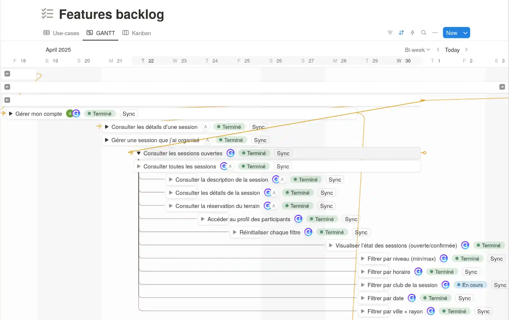
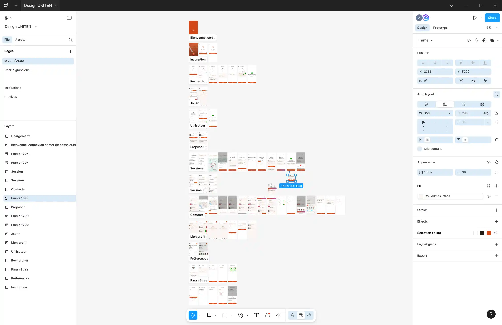
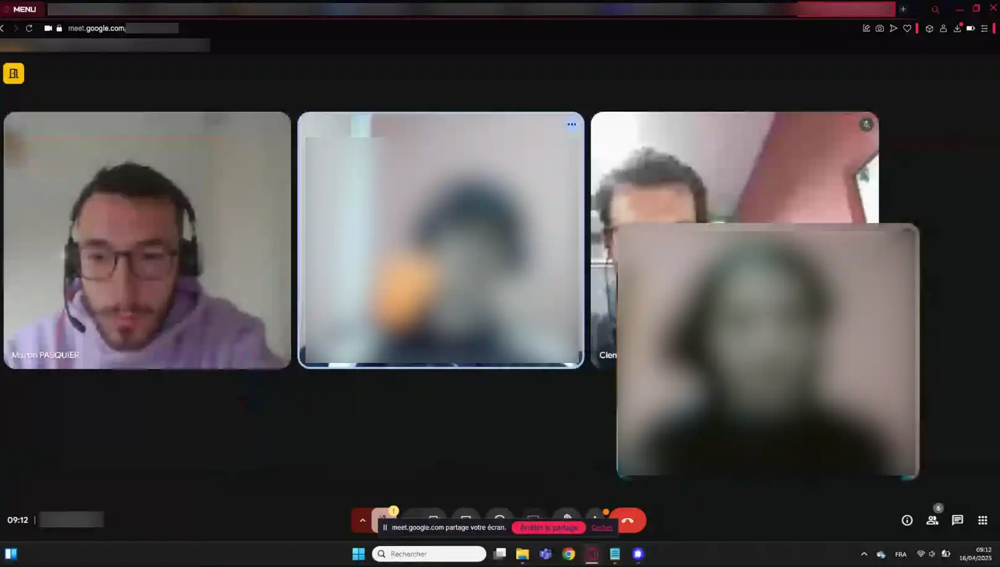
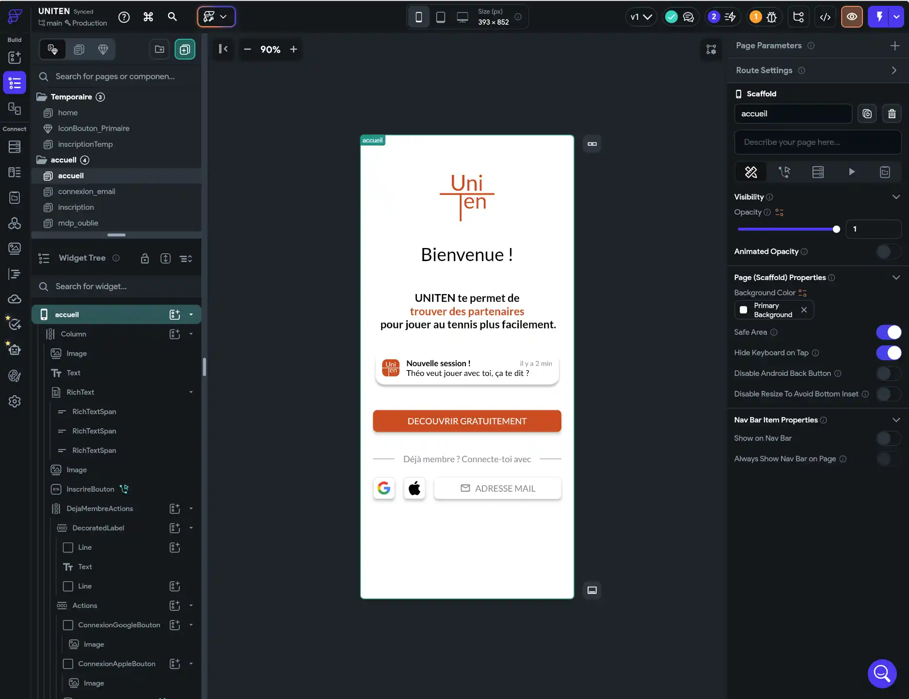
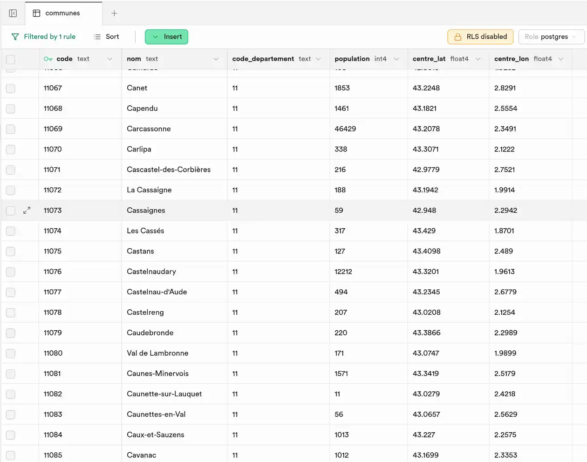
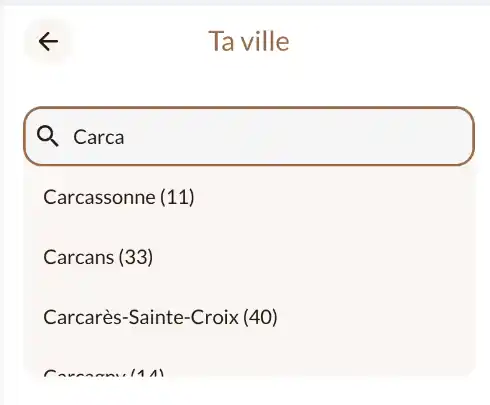
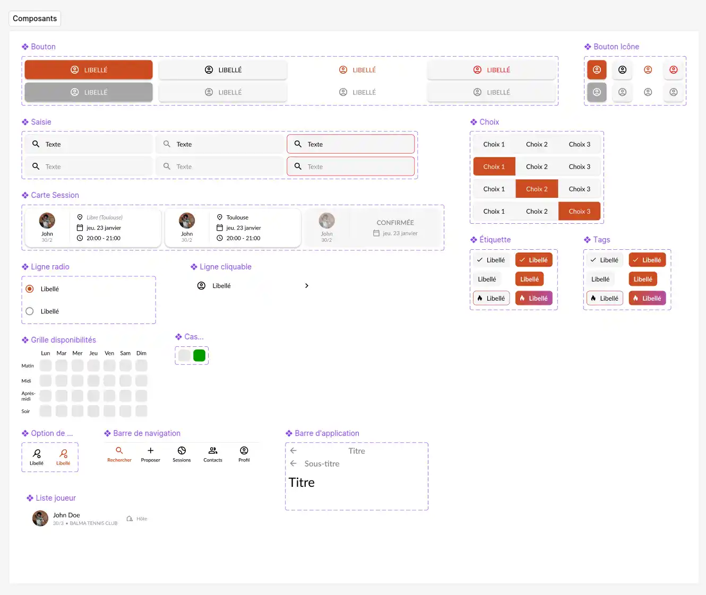
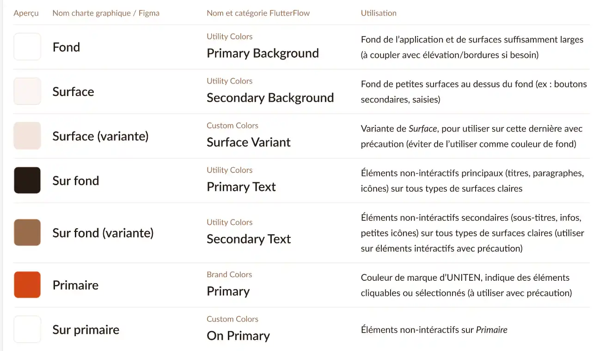
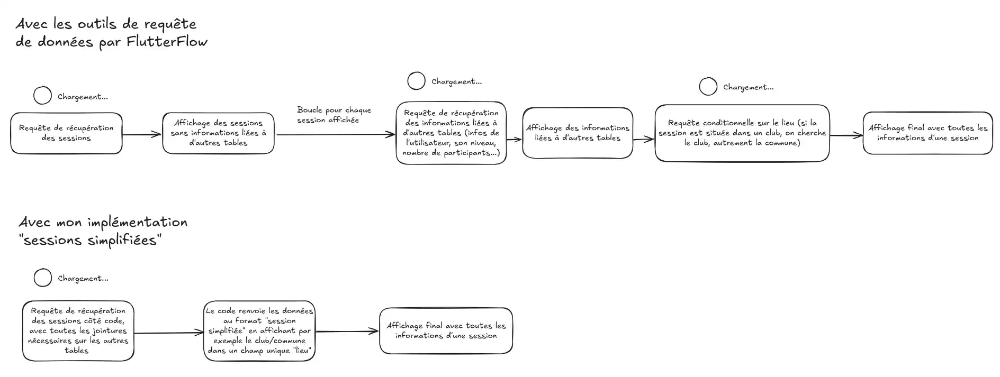

import Callout from "@components/Callout.astro";

<Callout title="Mise en contexte" variant="warning">
  Cet article est le rapport complet de mon stage dans la startup UNITEN
  effectué dans le cadre de ma deuxième année de BUT Informatique.  
  Aucune alteration n'a été effectuée par rapport à sa version rendue en PDF à l'exception
  de l'anonymisation de mes collègues.  
  Il est publié sur mon blog (clembs.com) avec l'accord de M. PASQUIER dans un
  but d'archivage.
</Callout>

## Note de confidentialité

Ce rapport comporte des éléments que mon maître de stage a jugé confidentiels. Une partie du contenu de certaines sections a été altérée ou retirée, comme indiqué par un avertissement suivant le titre des sections concernées.

## Remerciements

Au terme de ces 8 semaines dynamiques et chargées, je tenais à remercier mon maître de stage, Martin Pasquier, pour la confiance qu'il m'a accordé, les tâches qu'il m'a attribué, de toujours avoir été à l'écoute de mes remarques, de m'avoir encadré dans un milieu qui ne m'était pas familier et enfin de m'avoir fait connaître le Catalyseur et le monde de l'entrepreneuriat.

Je remercie également mes collègues stagiaires de l'IUT, Adam Ben Frej et Adrian Androaie, avec qui nous avons échangé beaucoup de moments très sympathiques, de problèmes techniques mais surtout de victoires. Je les remercie surtout d'avoir gardé leur patience malgré mes nombreuses suggestions de [refactorisation](#refactorisation).

Enfin, je remercie M. Brice Arnault de nous avoir enseigné les principes du développement mobile en Flutter, pour ses conseils inestimables, et de s'être rendu très disponible et de manière bienveillante.

Plus généralement, je remercie tout le corps enseignant du département informatique de l'IUT pour les cours dispensés, les connaissances qu'ils m'ont apporté et qui m'ont facilité l'insertion professionnelle.

## Table des matières

- [Note de confidentialité](#note-de-confidentialite)
- [Remerciements](#remerciements)
- [Introduction](#introduction)
- [I. Présentation d'UNITEN](#i-présentation-duniten)
  - [1. L'entreprise](#1-lentreprise)
  - [2. Lieu et horaires de travail](#2-lieu-et-horaires-de-travail)
  - [3. Environnement de travail](#3-environnement-de-travail)
- [II. Analyse des missions](#ii-analyse-des-missions)
  - [1. Prise en main de FlutterFlow, outil low-code tout-en-un](#1-prise-en-main-de-flutterflow-outil-low-code-tout-en-un)
  - [2. Récupération des communes via une API](#2-récupération-des-communes-via-une-api)
  - [3. Recréation du système de design](#3-recréation-du-système-de-design)
  - [4. Extraction des données clefs](#4-extraction-des-données-clefs)
  - [5. Algorithme de classement et optimisation](#5-algorithme-de-classement-et-optimisation)
- [III. Méthodologie](#iii-méthodologie)
  - [1. Démarche et choix](#1-démarche-et-choix)
  - [2. Organisation](#2-organisation)
  - [3. Outils utilisés](#3-outils-utilisés)
- [IV. Résultats et bilan](#iv-résultats-et-bilan)
  - [1. Bilan professionnel](#1-bilan-professionnel)
  - [2. Bilan personnel](#2-bilan-personnel)
  - [3. Bilan de mon maître de stage sur FlutterFlow](#3-bilan-de-mon-maître-de-stage-sur-flutterflow)
- [Conclusion](#conclusion)
- [Glossaire et sitographie](#glossaire-et-sitographie)

## Introduction

Entrepreneur et joueur de tennis, M. Martin PASQUIER a eu l'idée de réaliser une application mobile pour faciliter la recherche et le partage de sessions de tennis aux joueurs de la France entière. Souhaitant déployer son idée plus rapidement et n'ayant pas toutes les connaissances techniques nécessaires, il cherchait des stagiaires pour réaliser intégralement cette application en moins de 8 semaines.

Suivant plusieurs mois de recherche en amont, il avait décidé d'utiliser la plateforme complète de développement mobile « low-code » [FlutterFlow](#flutterFlow) couplé avec [Supabase](#supabase), un service back-end complet basé sur PostgreSQL qui offre une base de données, un système d'authentification et du stockage de fichiers.

Mon expérience actuelle pour le développement web et mon intérêt pour le mobile m'a motivé à candidater pour ce poste, un des seuls proposant du développement mobile. Nous terminions l'année de BUT Informatique avec le projet Flutter et Supabase est déjà l'outil de choix dans plusieurs de mes projets personnels. En conséquent, je souhaitais maîtriser ces technologies qui me sont déjà familières, tout en apprenant à travailler dans le contexte d'un projet entrepreneurial qui est celui de M. PASQUIER.

Dans le cadre de mon stage de deuxième année de BUT Informatique, 2 collègues de l'IUT Informatique et moi-même ont eu la chance d'intégrer la micro-entreprise de M. PASQUIER afin d'apporter une expertise technique pour développer cette application et les divers modules associés, ceci avec et sans code.

Au sein de ce rapport, nous allons tout d'abord présenter l'entreprise de M. Martin Pasquier ainsi que l'organisation au sein notre l'équipe. Ensuite, nous analyserons les missions principales que j'ai effectué au cours de ce stage. Troisièmement, nous aborderons mon approche du travail réalisé, mes méthodes, et les outils utilisés. Enfin, nous reviendrons sur les fruits de notre travail après 8 semaines de stage et établirons mon bilan professionnel et personnel, en abordant le point de vue de mon maître de stage sur l'outil principal utilisé.

## I. Présentation d'UNITEN

### 1. L'entreprise

Mon maître de stage, Martin PASQUIER, est un jeune diplômé de l'INP ENSIACET à Toulouse. Il fonde une micro-entreprise à son nom il y a 4 ans comme un tremplin pour toutes ses activités économiques personnelles.

UNITEN est son premier gros projet créé il y a moins d'un an, qui profite de l'accompagnement du Catalyseur, une structure incubatrice de l'Université de Toulouse qui forme, conseille et accompagne les jeunes personnes avec des projets d'entreprenariat. Le projet se montre sous forme d'une application mobile, souhaitant aider les joueurs de tennis à facilement trouver des partenaires.

M. PASQUIER, dans l'objectif de créer une application populaire et dynamique, réalise souvent des entretiens avec des investisseurs potentiels, des joueurs de tennis, des proches et des professionnels, dans lesquels il présente sa vision pour UNITEN.

À terme, Martin PASQUIER souhaite créer une société qui détiendrait UNITEN, dont le concept serait étendu à l'avenir sur d'autres sports, ainsi que d'autres projets. La société lui faciliterait aussi l'embauche de salariés à l'avenir pour l'aider dans le développement de son projet.

### 2. Lieu et horaires de travail

La majorité du temps de travail à développer UNITEN s'est déroulé dans l'espace de co-working du Catalyseur avec mes collègues stagiaires du BUT Informatique, Adam Ben Frej et Adrian Andrioaie, ainsi que mon tuteur. Co-working oblige, nous fréquentions l'équipe du Catalyseur ainsi que les autres start-ups, avec leurs stagiaires pour certaines.

L'ambiance était généralement très positive, nous nous entendions bien avec tout le monde, et tout était relativement paisible et silencieux excepté quand de rares animations ou conférences se déroulaient.

La présence de tableaux blancs dispersés dans la salle permettait de souvent se réunir pour aborder des sujets complexes concernant l'application avec des schémas pour mieux se faire comprendre. Différentes salles de réunion pouvaient être réservées également.

En terme d'horaires, nous travaillions généralement de 9 heures à 17 heures, avec une pause d'une heure pour se restaurer.

### 3. Environnement de travail

Avant de détailler mes missions, je souhaite donner du contexte concernant la façon dont l'application est gérée, et comment nous concrétisons dans un produit fini une simple idée.

Tout d'abord, une page sur l'outil de prise de notes et de productivité Notion rend compte de la progression du projet. Chaque tâche est attribuée à un membre, est catégorisée et comprend plusieurs sous-tâches.

<figure>

<figcaption>
  Figure 1 : La vue GANTT de la progression du projet
</figcaption>
</figure>

M. PASQUIER avait établi un fichier [Figma](#figma) dans lequel se trouve des maquettes correspondant à toutes les différentes pages. Nous y reviendrons par la suite, mais cela permet d'établir des visuels plus clairs sur la mise en place des fonctionnalités et des liens explicites entre elles.

<figure>

<figcaption>
  Figure 2 : Le fichier Figma, comportant les pages de l'application, les composants et autres éléments de la charte graphique  
</figcaption>
</figure>

Chaque matin, une réunion type Daily SCRUM se déroule dans laquelle chaque membre détaille sa progression de la veille ainsi que les tâches qu'il souhaite compléter dans la journée. Lorsque notre maître de stage était absent pendant la journée, nous avons effectué la réunion en visioconférence sur la plateforme Google Meet.

<figure>

<figcaption>
  Figure 3 : Une des réunions sur Google Meet. Mon aperçu est caché derrière
  celui d'Adam.
</figcaption>
</figure>

Tous les vendredis, une réunion individuelle avec M. PASQUIER est planifiée dans laquelle nous discutons personnellement de notre charge et notre rythme de travail ainsi que de nos rapports de stage respectifs. Cette réunion est suivie par une réunion d'équipe dans laquelle nous débriefons sur la semaine, notre progression générale et sur la stratégie à suivre la semaine qui suit (c'est-à-dire où nous devons prendre plus ou moins de temps, ainsi que l'implémentation technique de certaines fonctionnalités).

En ce qui concerne les discussions internes, nous avons choisi la messagerie professionnelle Slack qui s'une organisation en plusieurs canaux (pour l'aide, la progression, les annonces...) et des messages privés pour discuter entre stagiaires ou directement à M. PASQUIER.

<figure>

<figcaption>
  Figure 4 : L'espace de travail Slack d'UNITEN. Le canal #dev est montré.
</figcaption>
</figure>

Une fois la charge de travail établie pour chacun pour la journée, nous commençons nos missions sur nos outils (FlutterFlow, Supabase, [Firebase](#firebase), Figma ou simplement un éditeur de code).

Enfin, un Mac Mini acheté durant le stage par M. PASQUIER nous a servi à effectuer des tests et rectifications techniques sur le développement pour iOS.

## II. Analyse des missions

Avant de commencer l'analyse des différentes missions qui m'ont été confiées, je tiens à préciser que nous avions tous été plus ou moins impliqués dans toutes les échelles du développement de l'application. Je n'aborderais donc que les missions confiées qui me semblaient les plus pertinentes de détailler pour ce rapport.

### 1. Prise en main de FlutterFlow, outil low-code tout-en-un

Notre stage commence avec la prise en main de l'outil FlutterFlow, qui permet quasiment de prendre en main toutes les étapes de développement d'une application mobile. Cet outil comprend un éditeur visuel très intuitif, une gestion de la logique par blocs, une intégration à des services [backend-as-a-service](#supabase) à des systèmes de paiement, un déploiement sur les boutique d'applications facilités et bien plus encore.

Il est dit « low-code » car permet l'intégration de paquetages [Dart](#dart), et d'écrire des fonctions et classes en Dart. Car oui, comme son nom l'indique, FlutterFlow est basé sur [Flutter](#flutter), l'infrastructure multiplateforme de Google. Cela est rassurant pour des stagiaires ayant assisté aux cours sur le développement mobile de M. ARNAULT, qui enseignait également Flutter. Nous ne sommes donc pas dépaysés, et les mêmes widgets et conventions se traduisent bien dans FlutterFlow.

Notre première journée commence en créant un projet à concevoir sur FlutterFlow afin de nous entraîner avec l'outil sans casser les fondations de M. PASQUIER sur son projet, et de faire passer du temps avant que ce dernier nous achète des licenses payantes _Team_ au bon timing. Adam et moi avons tous les deux essayé de recréer [La Tchatche Mobile](#la-tchatche), notre projet de fin d'année universitaire.

<figure>

<figcaption>
  Figure 5 : Recréation de la page des discussions de La Tchatche. À gauche,
  l'écran original en code Flutter. À droite, la version FlutterFlow.
</figcaption>
</figure>

Je m'habitude vite au programme qui, malgré son interface simple, intègre la même logique de code que Flutter, simplement sous forme plus « visuelle » (mais limitée car nous ne pouvons pas directement toucher le code généré par FlutterFlow, ni le voir sans payer). Mon maître de stage m'autorise alors à directement attaquer la recréation sur son projet FlutterFlow de la page de bienvenue, réalisée sur Figma avant mon arrivée.

<figure>

<figcaption>
  Figure 6 : La page de bienvenue d'UNITEN sur l'éditeur FlutterFlow
</figcaption>
</figure>

Très vite, je me sens frustré par la lenteur perceptible de l'outil par rapport au code où je me sens plus à l'aise de rapidement itérer en tapant au clavier qu'en cliquant sur des dizaines de boutons. Cependant, je comprends que cela reste plus simple à éditer visuellement, et le résultat de code obtenu me semble plus propre qu'un produit codé par mes soins en Flutter (étant novice dans le logiciel).

### 2. Récupération des communes via une API

Inquiet que ce stage finisse en démonstration de clics sur des boutons et non pas une véritable démonstration de mes connaissances de développeur, je demande à mon maître de stage s'il ne peut pas me donner du travail de code.

Nous devions intégrer un menu pour que l'utilisateur puisse sélectionner sa ville pour l'afficher dans son profil. M. PASQUIER avait essayé de faire appel à l'[API REST](#api-rest) gouvernementale de recherche de lieux pour cela, sans succès. Je propose alors de rédiger un bref script pour [Bun](#bun), pour récupérer l'entièreté des communes et les stocker dans la base de données du projet. Il y a aussi un enjeu de souveraineté des données et de réduire les dépendances à d'autres outils, surtout pour des données triviales et immuables telles que la liste des communes françaises.

C'est donc exactement ce que je fais, et en une heure le programme récupère et stocke bien les 35 071 communes qui composent notre France métropolitaine et d'outre-mer.

<figure>

<figcaption>
  Figure 7 : La table « communes » dans la base de données
</figcaption>
</figure>

<figure>

<figcaption>Figure 8 : La recherche de communes sur UNITEN</figcaption>
</figure>

### 3. Recréation du système de design

Voyant mes connaissances en design et mes remarques sur ses maquettes Figma, M. PASQUIER et moi nous mettons d'accord pour que je refasse toutes les maquettes de l'application en utilisant de meilleures conventions de design pour quelque chose de plus épuré et maintenable, tout en gardant la philosophie et le design de base de M. PASQUIER.

<figure>

<figcaption>
  Figure 9 : Les composants de la charte graphique d'UNITEN
</figcaption>
</figure>

Ce nouveau système de design s'accompagne de changements esthétiques mineurs, tels que les couleurs, une harmonisation des icônes et des couleurs. Pour aider à la transition de ces maquettes dans FlutterFlow et faciliter la compréhension du système auprès des collaborateurs actuels et futurs, j'ai rédigé une documentation sur l'implémentation d'icônes ainsi que sur les couleurs à utiliser :

<figure>

<figcaption>
  Figure 10 : Extrait de la documentation sur les couleurs d'UNITEN
</figcaption>
</figure>

<figure>

<figcaption>
  Figure 11 : Refonte initiale de la page d'une session. À gauche, la page
  conçue par M. PASQUIER. À droite, ma refonte avec les nouveaux composants.
</figcaption>
</figure>

Après plusieurs semaines de développement, mon maître de stage a un rendez-vous avec les personnes qui l'accompagnent au Catalyseur pour qu'ils testent enfin l'application, dans un état d'alpha semi-stable. Outre les divers bogues et soucis techniques attendus, ce qui a le plus retenu notre attention était que le design faisait très « site web », avec peu d'animations, de couleurs, trop de menus imbriqués et de texte.

J'ai donc proposé à M. PASQUIER de complètement revoir le design de pages clefs, en faisant plus d'analyse de l'existant sur les applications mobiles et les systèmes de design épurés (tel que Material Design 3 de Google, les Human Interface Guidelines d'Apple, de Discord, d'Airbnb...).

Nous avons conclu sur cette nouvelle version complètement revue, utilisant des nuances de orange (couleur de la terre battue, symbole du tennis), optant pour des surfaces plus distinctes et arrondies, des libellés clairs là où il en faut et une mise en page en raccord avec les applications modernes.

<figure>

<figcaption>
  Figure 12 : Seconde refonte de la page d'une session, plus « mobile ». À
  gauche, la page avec ma refonte initiale. À droite, le nouveau design
  simplifié et plus accessible.
</figcaption>
</figure>

La page de session n'est qu'un des nombreux exemples de pages que j'ai modifié, et à chaque fois les retours étaient très positifs et vantaient le côté plus évident du design, qui rappelle tout de suite les applications mobiles traditionnelles à l'ergonomie perfectionnée.

L'implémentation technique fût relativement simple, comme nous avions déjà établi les différentes variables, constantes et couleurs dans Figma comme dans FlutterFlow. Nous n'avions plus qu'à éditer la mise en forme des pages les plus retouchées.

### 4. Extraction des données clefs

<Callout variant="warning">
  Le contenu de cette section a été modifié de sa version originale pour des
  raisons de confidentialité et de respect du secret d'entreprise.
</Callout>

Un de nos défis techniques qui nous a longuement ralentis lors de notre travail à UNITEN fût la récupération de la liste des clubs de tennis enregistrés en France, et des courts de tennis que les joueurs peuvent renseigner dans l'application.

M. PASQUIER a pendant plusieurs semaines essayé de négocier auprès de la Fédération Française de Tennis (FFT) un accès à leurs API REST pour accéder aux données de clubs directement, sans succès. En ce qui concerne les terrains, une API gouvernementale qui les liste tous semblait prometteuse, mais hélas est pleine d'incohérences, de flous et manque un moyen clair de les relier à des clubs de tennis.

C'est pour cela qu'il a été décidé d'extraire les données de sites de réservation et de clubs de tennis. Le processus étant complexe et long, mon maître de stage m'a donné sa confiance pour assurer le processus d'extraction en le codant.

Le scraping, ou l'extraction de données, est une technique consistant à programmatiquement lancer un navigateur invisible qui peut, à l'aide de sélecteurs CSS, récupérer des éléments d'une page web donnée pour en récupérer le contenu. Ma mission était donc de concevoir un script qui, à partir de plusieurs sources, enregistre dans la base de données des clubs de tennis.

Cette mission fût de loin ma plus longue, avec plus d'une semaine complète. Le scraping était nouveau pour moi, j'ai donc décidé d'apprendre l'outil le plus populaire, [Puppeteer](#puppeteer), et d'élaborer un projet composé de plusieurs fichiers TypeScript. Le script pour Bun récupère les données depuis plusieurs sources et les insère dans la base de données, en évitant les doublons et en gérant les erreurs dans un fichier texte pour identifier les potentiels problèmes dans le code (taux d'erreur final d'environ 0.01%).

Au final, ce sont quelques milliers de clubs et d'installations qui ont pu être recensés automatiquement via le script, ce qui aurait été plus long à faire à la main. Les données sont complètes et claires à utiliser dans le projet FlutterFlow, et le script peut être ré-exécuté à l'avenir pour récupérer de nouveaux clubs.

### 5. Algorithme de classement et optimisation

<Callout variant="warning">
  Le contenu de cette section a été modifié de sa version originale pour des
  raisons de confidentialité et de respect du secret d'entreprise.
</Callout>

De nos jours, beaucoup d'applications disposant d'une liste d'éléments quelconques générés par d'autres utilisateurs (des vidéos pour YouTube, des posts sur Linkedin, des annonces pour Leboncoin...) ont un fil principal trié par pertinence pour l'utilisateur. Ce tri, souvent opaque, utilise une forme d'algorithme de classement en fonction d'une multitude de critères.

Afin qu'UNITEN se démarque et soit plus personnalisé pour leurs utilisateurs, j'ai proposé un système similaire qui attribue des points aux sessions affichées dans la page d'accueil selon la proximité géographique avec l'utilisateur, la proximité de niveau, le nombre de contacts de l'utilisateur qui participent, et plus encore. Après avoir réussi à convaincre mes coéquipiers, nous étions lancés dans l'écriture d'une [edge function](#edge-function) pour permettre une récupération des sessions classées rapide et optimisée. Mon collègue Adrian s'est occupé du plus gros et je n'ai fait que repasser pour optimiser davantage et ajouter le critère de proximité géographique. Voici à peu près le calcul de points, qui servent de poids pour établir le classement de sessions par pertinence :

| Critère                | Description                                                                                                                                                                           |
| ---------------------- | ------------------------------------------------------------------------------------------------------------------------------------------------------------------------------------- |
| Proximité temporelle   | Plus la date de début de la session approche, plus le nombre de points augmente                                                                                                       |
| Proximité géographique | Plus les coordonnées GPS de la session (via le centre de la commune ou les coordonnées du club) est proche de la commune définie par l'utilisateur, plus le nombre de points augmente |
| Écart de niveau        | Plus le niveau de l'hôte de la session est proche de celui défini par l'utilisateur, plus le nombre de points augmente                                                                |
| Contacts inscrits      | Plus il y a d'utilisateurs dans les contacts de l'utilisateur qui participent à la session, plus le nombre de points augmente                                                         |
| Mise en avant          | Si l'hôte de la session a acheté le pack payant « Mise en avant » et que celui-ci est toujours valable, le nombre de points augmente                                                  |

Comme précisé plus tôt dans ce rapport, FlutterFlow s'intègre à des services de backend tout-en-un, plus précisément Firebase et plus récemment Supabase. Mon maître de stage avait choisi Supabase pour, entre autres, avoir une base de données relationnelle plus efficace. Hélas, l'intégration FlutterFlow ne permet pas de faire des requêtes SQL complexes ou de faire des jointures entre plusieurs tables sur une même requête.

Cela signifie que nous devons faire plusieurs requêtes imbriquées ./attachées à plusieurs widgets, qui chargent les uns après les autres en cascade, et crée non seulement un problème majeur d'optimisation, mais un visuel très peu professionnel dans lequel nous voyons des boucles de chargement imbriquées qui s'attendent.

Pour remédier à ce problème, j'ai proposé un système d'abstraction des données de session (sobrement intitulé "sessions simplifiées"), en déléguant au serveur la responsabilité d'envoyer les données de sessions au bon format. Autrement dit, au lieu de gérer la récupération des sessions directement via plusieurs requêtes imbriquées dans FlutterFlow, nous utilisons directement le code de la bibliothèque JavaScript ou Dart de Supabase pour récupérer les sessions et leurs informations présentes dans des tables reliées (par exemple, les communes ou clubs selon la présence d'un club pour le lieu d'une session) et le renvoyer dans un format plus simple à utiliser dans FlutterFlow.

C'est un gros contournement que nous avons effectué à une semaine de la fin du stage, mais le résultat est bel et bien présent et nous avons réduit considérablement les temps de chargement et l'affichage désagréable des chargements imbriqués.

<figure>

<figcaption>
  Figure 13 : Diagramme de la différence entre l'implémentation de l'affichage
  d'une liste de sessions, avant et après les "sessions simplifiées"
</figcaption>
</figure>

## III. Méthodologie

### 1. Démarche et choix

Ma méthodologie de travail se base sur l'efficacité et l'amélioration continue du projet, où j'approche les problèmes potentiels de manière proactive et collaborative. Chaque tâche qui m'est attribuée sur la page Notion est abordée avec rigueur, en tenant compte strictement des règles précédemment établies et en essayant de répliquer à la couche près les designs sur Figma.

J'ai une vision très critique qui me fait toujours remettre en question le projet pour identifier d'éventuelles pistes d'amélioration, telles que les refactorisations apportant de meilleures performances, des ajustements de design visant une meilleure ergonomie, ou une stratégie différente de stockage dans la base de données pour coller aux meilleures pratiques sur lesquelles je m'instruis continuellement dans le cadre personnel. J'ai pu tout au long de mon stage proposer ces modifications à mon maître de stage à qui j'expliquais clairement ma démarche avec des arguments concrets souvent tournés sur la gestion du projet sur le long terme du projet.

Souvent, M. PASQUIER accepte mes propositions ou argumente son point de vue de gestionnaire de projet, m'expliquant que ça peut prendre trop de temps, ne pas valoir le coup, ou expliquant sa vision originale sur un sujet que je souhaitais changer. Cela me permet d'échanger de manière constructive sur un projet pour lequel j'ai porté autant d'investissement que dans mes propres projets personnels, avec l'avantage de pouvoir avoir un point de vue différent du mien, moins dans la technicité et plus dans le pratique.

Enfin, lorsque mes tâches sont accomplies et que je dispose de temps supplémentaire, je soutiens les autres stagiaires. J'interviens sur leur travail pour appliquer les meilleures pratiques d'organisation du projet et assurer une cohérence globale dans notre travail. Cela permet non seulement de renforcer le projet mais aussi notre dynamique d'équipe soudée, quelque peu similaire aux travaux de groupe à l'IUT mais avec un contexte professionnel très différent, une expérience très enrichissante en somme.

### 2. Organisation

Nous avons rencontré plusieurs défis d'organisation tout au long du projet qui ont impacté notre fluidité et efficacité. Par exemple, le système de gestion des branches (une fonctionnalité intégrée à FlutterFlow) n'a pas été préparé du tout dans notre environnement de développement. Sans ce système, nous étions très ralentis, car contraints d'attendre que la personne travaillant sur une tâche spécifique termine et intègre ses modifications avant que quiconque puisse tester ou déployer son propre travail, autrement elle ne peut lancer l'application si un seul bug se présente à la compilation.

De plus, notre projet était dépourvu de tests unitaires et tests système (E2E), éléments essentiels pour assurer la qualité du logiciel et prévenir les bugs potentiels. Les tests utilisateur ont été mis en place très tard dans le processus, ce qui a limité leur efficacité à détecter des problèmes avant le déploiement final.

Malgré ce dernier point, au tout dernier jour du stage nous avons réussi à effectuer un test système commun. Nous avons inspecté chaque écran et chaque fonctionnalité de l'application pour nous permettre d'identifier les incohérences et bogues encore présents, ce qui nous a permis de créer des tickets sur un traqueur Notion, mais il était trop tard pour apporter nos propres correctifs.

### 3. Outils utilisés

J'ai eu la chance de pouvoir me servir de mon ordinateur personnel pour développer UNITEN, sous clause de propriété intellectuelle, et d'avoir le Mac mini de M. PASQUIER a disposition lorsque nous avions besoin de tester des fonctionnalités propres à iOS.

La majeure partie du temps, pour le développement de l'application en elle-même, j'utilisais FlutterFlow sur Google Chrome. Alors même que l'outil est développé avec Flutter qui est multiplateformes, il n'est pas fonctionnel sur le navigateur de mon choix (Firefox) et ne dispose d'aucune application sur mon système d'exploitation (Linux), probablement car les outils que j'utilise sont peu populaires et ne rentrent pas en compte dans les personnes cibles de FlutterFlow.

En ce qui concerne les parties codées, mon éditeur de choix est [VSCodium](#vscodium) et j'utilisais [TypeScript](#typescript) avec Bun dès que possible par habitude, aussi bien pour les scripts occasionnels que pour déployer les edge functions sur Supabase. Ces scripts ont été mis en ligne sur une organisation privée sur le répertoire de code GitHub.

## IV. Résultats et bilan

Comme dit précédemment, nous n'avons pas pu finir l'application dans son entièreté à temps. La grande majorité des fonctionnalités sont implémentées et fonctionnent, mais plusieurs bogues et complications techniques restent à être réglées. Fort heureusement, l'avantage de FlutterFlow pour M. PASQUIER est qu'il puisse reprendre le projet tel que nous l'avons laissé, avec en complément une documentation sur des sujets plus techniques pour l'aider et aider les futurs développeurs qui viendront après nous stagiaires sur le projet.

### 1. Bilan professionnel

Professionnellement parlant, j'ai été plutôt satisfait de mon rôle en temps que stagiaire avec des connaissances sûrement plus techniques qui ont permis plusieurs refactorisations visant à l'optimisation et l'ergonomie de l'application.

Bien que l'application ne soit pas complètement aboutie, le chemin est presque fini et nous nous sommes dépassés pour passer d'un prototype Figma à une application utilisable, et plus optimale et ergonomique qu'avant.

L'utilisation de FlutterFlow était un véritable test de ma patience, tant pour les temps de construction de l'application que l'interface en règle générale. Habitué de coder, je n'étais pas déboussolé, mais je me languissais vite de retourner sur une problématique nécessitant du code. Cependant, comprenant les besoins de mon maître de stage, j'ai appris à être plus tolérant et patient, et à savoir m'occuper de missions annexes en attendant le lancement de l'application, par exemple.

J'ai développé mes compétences en communication d'équipe, évidemment facilités par la nature de l'entreprise, et j'ai su gérer le stress qui est venu vers la fin du stage où nous pensions pouvoir sortir l'application (avant le remaniement de M. PASQUIER qui a retardé l'échéance). Notre équipe avançait très vite, et ce malgré toutes les impasses posées par FlutterFlow, et je suis très reconnaissant du travail de mes collègues également sans qui il aurait été impossible d'arriver au moment où nous avons quitté l'entreprise.

Enfin, ce stage a renforcé mon désir d'explorer davantage le développement mobile, que je n'avais jamais pris à cœur jusqu'à présent.

### 2. Bilan personnel

À titre personnel désormais, je suis comblé d'avoir pu mettre autant de connaissances sur le développement applicatif au service du véritable projet grand public qu'est UNITEN. Jusqu'à présent, mes nombreux projets personnels et projets universitaires n'ont servi que d'entraînement qui n'avaient pour but principal qu'acquérir ces connaissances dont je me suis servi pour le stage.

Avec l'accompagnement de M. PASQUIER, j'ai pu voir sa façon de voir les choses sur l'organisation d'un projet aussi grand, qui est parfois complètement différente de mon point de vue. C'est enrichissant car cela nous permet de nous remettre en question, de douter, et d'encore se motiver à faire toujours mieux. Les retours des personnes à qui il montrait le projet l'ont aussi remis en question et nous avons fait énormément évolué le projet sur plein de questions qui ne s'étaient encore jamais posées.

La satisfaction de voir mon travail contribuer à un projet grand public a été immense et me motive à continuer dans cette voie, et j'espère que la pierre que j'aurais posé sur l'édifice qu'est UNITEN lui permettra d'autant convaincre son public qu'il a pu convaincre les personnes qui ont testé l'application, avec des retours très positifs.

### 3. Bilan de mon maître de stage sur FlutterFlow

Nous avons, à l'issue de notre entretien final, discuté M. PASQUIER et moi-même de ses retours sur FlutterFlow. Ce qui suit est une recréation des propos de mon maître de stage à partir de points élaborés à partir dudit entretien.

Globalement, mon maître de stage est très satisfait de l'outil, qu'il trouve reconnu, intuitif et simple à utiliser. Il met en avant son très large éventail de fonctionnalités incluses, que la plupart sont gratuites et que l'outil n'est pas si cher lorsqu'il est nécessaire de passer à la caisse. Il est rassuré que le programme soit régulièrement maintenu avec beaucoup de mises à jour et que le support technique soit au rendez-vous rapidement lors de complications. Ces mêmes complications et limites de FlutterFlow, confrontées de plus en plus fréquemment au sein du projet, restent souvent simples à contourner.

Ultimement, il est utile de rappeler que FlutterFlow est le seul outil commercial et professionnel proposant de pouvoir développer toute une application mobile fonctionnelle en allant aussi loin, et que sans lui, M. PASQUIER ne pourrait même pas continuer à développer l'application par lui-même. Compte tenu de son statut d'entrepreneur individuel qui ne peut se permettre une équipe de développeurs, et de son temps limité qui fait qu'il ne peut pas apprendre à coder autant, FlutterFlow marque un équilibre parfait pour développer de petites à moyennes applications sans trop de hic et à moindre coût.

## Conclusion

Pour conclure, ce stage à UNITEN a été pour moi une occasion précieuse de grandir professionnellement et personnellement. Travailler dans une petite équipe dynamique où chacun à son mot à dire et où l'on avance de manière manifeste m'a permis d'acquérir une compréhension plus profonde du développement mobile, un domaine qui s'impose désormais comme un des axes centraux de ma carrière.

Il entre parfaitement dans mon projet professionnel de m'élargir sur plus de domaines autres que le développement web, dans lequel je me spécialisais jusqu'à présent. Je réalise l'impact du mobile dans le monde des applications grand public, et compte personnellement explorer plus en détail des technologies comme React Native, Jetpack Compose ou SwiftUI.

Mon maître de stage, M. PASQUIER, m'a toujours écouté avec bienveillance, et m'a véritablement guidé dans le monde de l'entrepreneuriat et la gestion d'entreprise. Nos échanges où je démontrais mon sens du travail bien fait m'ouvrent désormais à toujours plus d'opportunités professionnelles, telles que l'alternance ou les prestations libérales.

## Glossaire et sitographie

### FlutterFlow

Logiciel fondé par deux ex-ingénieurs chez Google permettant de concevoir des applications mobile grâce à un éditeur visuel, intégrant des passerelles pour utiliser du code Dart (language de programmation).

- https://www.flutterflow.io (site en anglais)

### Flutter

Une infrastructure logicielle permettant le codage d'applications multiplateformes (iOS, Android, Web, Linux, macOS et Windows) à partir d'une base de code [Dart](#dart).

- https://flutter.dev (site en anglais)
- https://aws.amazon.com/fr/what-is/flutter

### Dart

Un langage de programmation développé par Google et optimisé pour créer des applications multiplateformes. Du code Dart peut être compilé (transformé) en du code JavaScript pour l'exécution sur le web, mais s'utilise surtout dans le cadre du développement d'applications avec Flutter.

- https://dart.dev (site en anglais)

### Supabase

Service open-source fondé sur la base de données PostgreSQL, offrant depuis une interface web la gestion d'une base de données relationnelle, de l'authentification d'utilisateurs, d'un système de stockage et d'[edge functions](#edge-function). Une version hébergée freemium est proposée pour les entreprises.

- https://supabase.com (site en anglais)

### Firebase

Service similaire à [Supabase](#supabase) créé avant lui par Google, en source fermée et fondé sur une base de données orientée documents.

- https://firebase.google.com (site en anglais)
- https://fr.wikipedia.org/wiki/Base_de_donn%C3%A9es_orient%C3%A9e_documents

### Edge function

Une "serverless function" est généralement défini comme un script synchrone exécuté sur un serveur. Il a une limite de temps d'exécution, ne persiste aucun état (stateless) et est invoqué à la demande (cold start). L'implémentation la plus connue est AWS Lambda. Le terme "edge function" désigne une serverless function qui s'exécute sur le serveur le plus proche de l'utilisateur disponible.

- https://aws.amazon.com/fr/lambda

### Figma

Outil de conception graphique et de prototypage collaboratif, permettant de créer des interfaces au niveau de maquette basique comme de prototype interactif avancé.

- https://www.figma.com/fr-fr/design

### La Tchatche

Projet universitaire en R4.A.10 (complément web) de messagerie instantanée réalisée par mes soins en PHP. Une [API](#api-rest) pour accéder à la messagerie a ensuite été conçue et a permis l'existence de La Tchatche Mobile, un client mobile élaboré par Adam et moi en Flutter pour le projet de R4.A.11 (développement mobile).

- https://latchatche.clembs.com

### VSCodium

Éditeur de code open-source basé sur le très populaire Visual Studio Code de Microsoft sans les dépendances Microsoft et en réimplémentant certaines fonctionnalités propriétaires.

- https://vscodium.com (site en anglais)

### Bun

Système d'outillage complet pour exécuter du code JavaScript et [TypeScript](#typescript) sur un serveur. Il comprend notamment un environnement d'exécution, de tests unitaires, un débogueur, un serveur HTTP. https://bun.sh (site en anglais)

### TypeScript

Langage de programmation développé par Microsoft qui complète le langage JavaScript avec un système de typage et de détection de types.

- https://www.typescriptlang.org (site en anglais).

### API REST

Ensemble de règles permettant à un service de rendre certaines données accessibles et modifiables à des ordinateurs tiers via Internet, organisée par ressources et entités. Par exemple, l'[API Sirene](https://api.gouv.fr/guides/api-definition) de l'État permet à n'importe quel ordinateur de faire une recherche sur les entreprises françaises.

- https://api.gouv.fr/guides/api-definition
- https://fr.wikipedia.org/wiki/Interface_de_programmation

### Puppeteer

Outil de scraping en JavaScript qui permet de lancer un navigateur invisible (headless) et de le contrôler de manière programmée.

- https://pptr.dev (site en anglais)

### Refactorisation

Refactoring en anglais, c'est une pratique qui consiste à remanier un morceau de code afin de le rendre plus lisible et optimisé.

- https://www.ibm.com/fr-fr/think/topics/code-refactoring
- https://fr.wikipedia.org/wiki/R%C3%A9usinage_de_code
